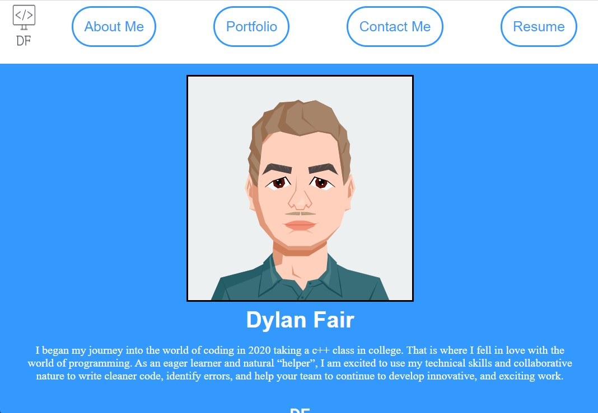

# React-Portfolio

## Description

My portfolio built with react.js

## Table of Contents
* [Installation](#installation)
* [Usage](#usage)
* [License](#license)
* [Contributing](#contributing)
* [Tests](#tests)
* [Questions](#questions)
    
## Installation

Npm i all the dependecies after you clone the repo.
See the website @ https://dylan-fair.github.io/React-Portfolio/

## Usage

to present myself professionally

## License

github

## Contributing

Just me :)

## Tests

React/jest

## Questions
[Link to my GitHub for further questions!](https://github.com/dylan-fair/React-Portfolio)
[My Email for further question!](dylanfair11@gmail.com)

    
    
